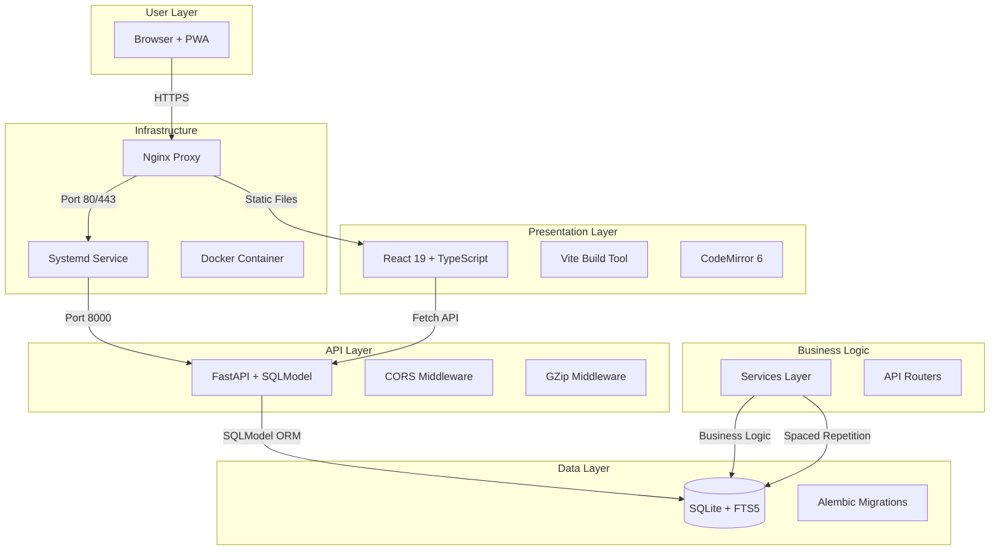
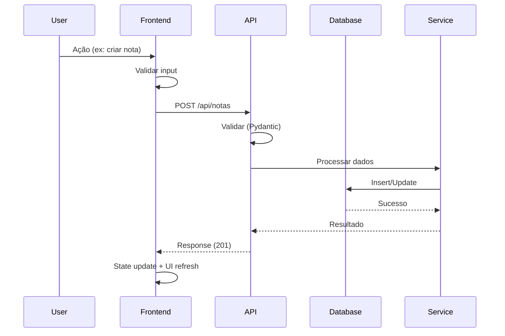

# MindFlow — Documentação de Arquitetura

> Visão geral da arquitetura do sistema, padrões de design e interações entre componentes.

## 🎯 Visão Arquitetural

### High-Level Architecture


---

## 📐 Estrutura de Camadas

### Layer 1: Presentation Layer (Frontend)
**Responsabilidade**: Interface com usuário, renderização visual

**Componentes**:
- **React 19**: Framework de UI com hooks
- **TypeScript**: Type safety
- **Vite**: Build tool com hot reload
- **Tailwind CSS v4**: Styling com @theme

**Camadas de Componentes**:
```
frontend/
├── components/
│   ├── reutilizáveis (Sidebar, Editor, Modais)
│   ├── presentacionais (Dashboard, Cards)
│   └── container (Páginas)
├── hooks/ (custom hooks)
├── pages/ (rotas específicas)
└── store/ (contexts)
```

**Arquitetura de Componentes**:
- **Container Pattern**: `page.tsx` contém lógica + estado
- **Smart Components**: Conexão com API + estado global
- **Dumb Components**: Pure UI, recebem props

### Layer 2: API Layer (Backend)
**Responsabilidade**: Comunicação HTTP, autenticação, CORS

**Framework**: FastAPI + Uvicorn (ASGI)

**Middleware Configurado**:
```python
app.add_middleware(GZipMiddleware, minimum_size=500)
app.add_middleware(
    CORSMiddleware,
    allow_origins=["http://localhost:5173", "http://localhost:8000"],
    allow_credentials=True,
    allow_methods=["*"],
    allow_headers=["*"]
)
```

**Routers**: Módulos separados por funcionalidade

### Layer 3: Business Logic Layer
**Responsabilidade**: Regras de negócio, transformações de dados

**Services**:
- `services/spaced_repetition.py`: Algoritmo SM-2
- `services/notes.py`: Wikilinks, templates, grafo
- `services/estatisticas.py`: Cálculos estatísticos

### Layer 4: Data Access Layer
**Responsabilidade**: ORM, migrations, queries

**ORM**: SQLModel (wrapper sobre SQLAlchemy)
**Database**: SQLite com WAL mode
**Migrations**: Alembic para versionamento

---

## 🔌 Comunicação Entre Camadas

### Frontend → Backend
```typescript
// api/client.ts — Cliente HTTP centralizado
const client = {
  async request<T>(url: string, options: RequestOptions = {}): Promise<T> {
    try {
      const response = await fetch(url, {
        headers: { 'Content-Type': 'application/json' },
        signal: AbortSignal.timeout(10000),
        ...options
      });
      
      if (!response.ok) {
        throw new Error(`HTTP ${response.status}`);
      }
      
      return JSON.parse(await response.text());
    } catch (error) {
      console.error('[API]', error);
      throw error;
    }
  }
};
```

### Router Patterns
```python
# backend/routers/notas.py
@router.get("/")
async def get_notas(
    session: Session = Depends(get_session),
    pasta_id: Optional[int] = None,
    q: Optional[str] = None
):
    """GET /api/notas — Lista notas com filtros"""
    query = select(Nota)
    
    if pasta_id:
        query = query.where(Nota.pasta_id == pasta_id)
    
    if q:
        # Busca full-text com FTS5
        query = query.join(notas_fts).where(
            notas_fts.titulo.match(q)
        )
    
    return query.order_by(Nota.criado_em.desc()).all()
```

### Data Flow Pattern


---

## 🗄️ Database Design Patterns

### SQLModel ORM Pattern
```python
# backend/models.py
class Nota(SQLModel, table=True):
    __tablename__ = "notas"
    
    id: Optional[int] = Field(default=None, primary_key=True)
    titulo: str = Field(min_length=1, max_length=500)
    conteudo: str = ""
    pasta_id: Optional[int] = Field(default=None, foreign_key="pastas.id")
    propriedades: dict[str, Any] = Field(default_factory=dict)
```

### Relationship Patterns
```python
# Many-to-Many
class NotaTag(SQLModel, table=True):
    __tablename__ = "notas_tags"
    nota_id: int = Field(foreign_key="notas.id", primary_key=True)
    tag_id: int = Field(foreign_key="tags.id", primary_key=True)

# One-to-Many
class Tarefa(SQLModel, table=True):
    __tablename__ = "tarefas"
    bloco_id: Optional[int] = Field(default=None, foreign_key="blocos_rotina.id")
```

### Repository Pattern (implícito)
```python
# Routers são as "repositories"
@router.get("/notas/{nota_id}")
async def get_nota(
    nota_id: int,
    session: Session = Depends(get_session)
):
    return session.get(Nota, nota_id)
```

---

## 🔄 API Patterns

### CRUD Operations
```python
# Create
@router.post("/notas")
async def criar_nota(
    nota: NotaCreate,
    session: Session = Depends(get_session)
):
    db_nota = Nota(**nota.dict())
    session.add(db_nota)
    session.commit()
    session.refresh(db_nota)
    return db_nota

# Read
@router.get("/notas/{id}")
async def get_nota(id: int, session: Session = Depends(get_session)):
    return session.get(Nota, id)

# Update
@router.patch("/notas/{id}")
async def atualizar_nota(
    id: int,
    nota: NotaUpdate,
    session: Session = Depends(get_session)
):
    db_nota = session.get(Nota, id)
    for key, value in nota.dict(exclude_unset=True).items():
        setattr(db_nota, key, value)
    session.commit()
    return db_nota

# Delete
@router.delete("/notas/{id}")
async def deletar_nota(id: int, session: Session = Depends(get_session)):
    session.execute(delete(Nota).where(Nota.id == id))
    session.commit()
    return {"message": "Nota deletada"}
```

### Pagination Pattern
```python
@router.get("/notas")
async def get_notas(
    pagina: int = 1,
    limite: int = 20,
    session: Session = Depends(get_session)
):
    query = select(Nota).order_by(Nota.criado_em.desc())
    
    # Paginação
    offset = (pagina - 1) * limite
    result = session.exec(query.offset(offset).limit(limite)).all()
    
    return {
        "data": result,
        "meta": {
            "pagina": pagina,
            "limite": limite,
            "total": session.exec(select(func.count(Nota))).one()
        }
    }
```

### Response Patterns
```python
# Pydantic Models para responses
class NotaRead(SQLModel):
    id: int
    titulo: str
    conteudo: str
    pasta_id: Optional[int]
    tipo_id: Optional[int]
    criado_em: str
```

---

## 🚀 Async Patterns

### Async Context Manager
```python
@asynccontextmanager
async def lifespan(app: FastAPI):
    # Setup
    setup_logging()
    run_migrations()
    check_db_integrity()
    setup_fts()
    
    yield
    
    # Shutdown
    logger.info("MindFlow shutdown")
```

### Async Endpoints
```python
@router.get("/notas/grafo")
async def get_grafo(session: Session = Depends(get_session)):
    """Async endpoint para grafo de conhecimento"""
    notas = session.exec(select(Nota)).all()
    # Processamento assíncrono
    # Redis ou task queue para processamento pesado
    return processar_grafo(notas)
```

---

## 🧪 Test Patterns

### API Testing
```python
def test_criar_nota():
    response = client.post("/api/notas", json={
        "titulo": "Teste",
        "conteudo": "Conteúdo"
    })
    assert response.status_code == 200
```

### Integration Testing
```python
def test_fluxo_completo():
    # Setup
    client.post("/api/notas", json={"titulo": "Nota 1"})
    # Ação
    response = client.get("/api/notas")
    # Assert
    assert len(response.json()) == 1
```

---

## 📊 Monitoring Patterns

### Health Check
```python
@app.get("/health")
async def health_check(session: Session = Depends(get_session)):
    try:
        session.execute(text("SELECT 1")).scalar()
        return {"status": "healthy"}
    except Exception as e:
        raise HTTPException(status_code=503)
```

### Metrics
```python
from prometheus_client import Counter

REQUEST_COUNT = Counter('http_requests_total', 'Total requests')
REQUEST_DURATION = Histogram('request_duration', 'Request duration')
```

---

## 🔐 Security Patterns

### Input Validation
```python
class NotaCreate(SQLModel):
    titulo: str = Field(min_length=1, max_length=500)
    conteudo: str = Field(max_length=50000)
```

### CORS Configuration
```python
app.add_middleware(
    CORSMiddleware,
    allow_origins=["http://localhost:5173"],
    allow_credentials=True
)
```

---

## 🚧 Future Patterns

### Event-Driven Architecture
```python
# Queue de eventos
class EventBus:
    async def emit(self, event: Event):
        for handler in self.handlers[event.type]:
            await handler(event)
```

### CQRS Pattern (future)
```python
# Read Side (queries rápidas)
@router.get("/notas/ativos")
async def get_notas_ativas(query: ActiveNotesQuery):
    return query.execute()

# Write Side (comandos)
@router.post("/notas")
async def criar_nota(command: CreateNotaCommand):
    return command.execute()
```

---

*Última atualização: 16 de junho de 2026*
*Versão: v1.2.3*