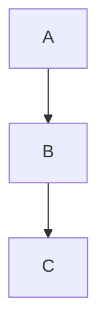

# Manual do MindFlow — Linux

Bem-vindo ao MindFlow, seu segundo cérebro local-first. Este manual cobre desde a instalação até o uso de todas as funcionalidades.

---

## Índice

- [Parte I — Instalação](#parte-i--instalação)
- [Parte II — Primeiros Passos](#parte-ii--primeiros-passos)
- [Parte III — Funcionalidades](#parte-iii--funcionalidades)
- [Parte IV — Avançado](#parte-iv--avançado)
- [Parte V — Manutenção](#parte-v--manutenção)

---

# Parte I — Instalação

## 1. Requisitos mínimos

| Requisito | Especificação |
|---|---|
| **Sistema** | Linux (testado em Mint, Ubuntu, Fedora) |
| **RAM** | 2 GB (recomendado: 4 GB) |
| **Disco** | 200 MB livres |
| **Python** | 3.10 ou superior |
| **Node.js** | 18 ou superior (apenas para o build inicial) |
| **Git** | Opcional (recomendado para atualizações) |

## 2. Instalar Python 3.10+

> O **start.sh** tenta instalar automaticamente se o Python não for encontrado.
> Abaixo estão as instruções manuais caso precise.

Abra o **Terminal** (Ctrl+Alt+T).

### Ubuntu / Linux Mint (22.04+)

```bash
sudo apt update
sudo apt install python3 python3-pip python3-venv
python3 --version
```

Ubuntu 22.04 já vem com Python 3.10 — não precisa de PPA.

Se a versão for inferior a 3.10:

```bash
sudo apt install software-properties-common
sudo add-apt-repository ppa:deadsnakes/ppa
sudo apt update
sudo apt install python3.10 python3.10-venv python3.10-pip
```

### Fedora

```bash
sudo dnf install python3 python3-pip
```

### Verificando

```bash
python3 --version
# Deve mostrar: Python 3.10.x ou superior
```

## 3. Instalar Node.js

Node.js só é necessário no primeiro uso (para compilar o frontend). Após o build, você pode até desinstalar.

```bash
curl -fsSL https://deb.nodesource.com/setup_22.x | sudo bash -
sudo apt install nodejs
node --version   # Deve mostrar v22.x
npm --version
```

## 4. Instalar Git (opcional)

```bash
sudo apt install git
git --version
```

O Git permite atualizar o MindFlow com um comando. Sem ele, você precisará baixar o ZIP manualmente.

## 5. Baixar o MindFlow

### Opção A — Git (recomendado)

```bash
cd ~
git clone https://github.com/anton12o/MindFlow.git
cd MindFlow
```

### Opção B — ZIP (sem Git)

1. Acesse https://github.com/anton12o/MindFlow/releases
2. Baixe o arquivo ZIP da versão mais recente
3. Extraia na sua pasta de preferência (ex: `~/MindFlow`)
4. No terminal, entre na pasta: `cd ~/MindFlow`

## 6. Primeira execução

```bash
cd ~/MindFlow
chmod +x start.sh
./start.sh
```

Ou, se preferir usar Make:

```bash
cd ~/MindFlow
make run
```

O que acontece automaticamente:

1. **Verifica** se Python 3.10+ e Node.js 18+ estão instalados — **se faltar, tenta instalar via apt/dnf/pacman**
2. **Cria um ambiente virtual Python** isolado (pasta `venv/`)
3. **Instala as dependências** do backend (`pip install`)
4. **Detecta que o frontend precisa ser compilado** e executa:
   - `npm install` (baixa bibliotecas do frontend)
   - `npm run build` (compila o frontend)
5. **Executa migrações** do banco de dados (Alembic)
6. **Sobe o servidor** em `http://localhost:8000`
7. **Abre o navegador** automaticamente

> Na primeira vez, isso leva de 1 a 5 minutos (depende da sua internet). Nas execuções seguintes, leva cerca de 5 segundos.

Se aparecer "Atualizar do GitHub? (S/n)", tecle **Enter** para pular (já está na versão mais recente).

## 7. Usar no dia a dia

```bash
cd ~/MindFlow && ./start.sh
# ou
cd ~/MindFlow && make run
```

O servidor sobe rapidamente e o navegador abre sozinho. Enquanto estiver rodando, mantenha o terminal aberto. Para sair, pressione **Ctrl+C**.

## 8. Atualizar o MindFlow

De vez em quando (a cada 2-4 semanas), recebemos atualizações com novos recursos e correções.

```bash
cd ~/MindFlow
./start.sh --update
```

Isso faz:

1. **`git pull`** — baixa o código mais recente
2. **`pip install`** — atualiza dependências do backend se necessário
3. **`npm run build`** — recompila o frontend
4. **Sobe o servidor** normalmente

---

# Parte II — Primeiros Passos

## 1. Visão geral da interface

Quando o MindFlow abre no navegador, você vê:

```
┌─────────┬──────────────────────────────────────────┐
│ Sidebar │            Área principal                 │
│         │                                           │
│ 📊      │   Bem-vindo ao MindFlow!                  │
│   Dash  │                                           │
│ 📅      │   ● 12 notas criadas                      │
│   Rotina│   ● 5 tarefas pendentes                   │
│ ⏱️      │   ● 3 flashcards para revisar             │
│   Foco  │   ● 2 sessões hoje                        │
│ 💡      │                                           │
│   Notas │   [📓 Diário de hoje]                     │
│ 📚      │                                           │
│   Flash │   ┌─ Inbox ───────────────┐               │
│ ✅      │   │ 3 itens pendentes     │               │
│   Hábitos│  │ [Abrir inbox]         │               │
│ 📊      │   └──────────────────────┘               │
│   Insig │                                           │
│ 📋      │   ┌─ Tarefas de hoje ────┐               │
│   Cons. │   │ ☐ Revisar笔记        │               │
│         │   │ ☑ Comprar pão         │               │
│ ⚙️      │   └──────────────────────┘               │
│   Config│                                           │
└─────────┴──────────────────────────────────────────┘
```

### Barra lateral (sidebar)

A sidebar é seu **menu de navegação principal**. Cada ícone leva a uma seção do app:

| Ícone | Seção | O que faz |
|-------|-------|-----------|
| 📊 | **Dashboard** | Visão geral do seu dia |
| 📅 | **Rotina** | Planeje blocos de horário e tarefas |
| ⏱️ | **Foco** | Timer Pomodoro para concentração |
| 💡 | **Notas** | Editor de notas com Markdown |
| 📚 | **Flashcards** | Repetição espaçada (SM-2) |
| ✅ | **Hábitos** | Rastreie hábitos diários |
| 📈 | **Insights** | Estatísticas e heatmap |
| 📋 | **Consultas** | Visualizações personalizadas |
| ⚙️ | **Config** | Configurações do app |

**Dicas:**
- A sidebar pode ser **recolhida** clicando no ícone de menu (três linhas) no topo
- Você pode **redimensionar** a sidebar arrastando a borda direita
- Os itens da sidebar podem ser **ocultados** em Config > Sidebar

### Atalhos essenciais para começar

| Atalho | Ação |
|--------|------|
| `Ctrl+I` | Captura rápida — solte uma ideia sem sair da tela |
| `Ctrl+K` | Paleta de comandos — navegue para qualquer página |
| `[[` no editor | Cria wikilink para outra nota |

## 2. Seu primeiro registro

Vamos criar sua primeira nota:

1. Pressione **Ctrl+I** para abrir a **Captura Rápida**
2. Digite "Minha primeira ideia no MindFlow"
3. Clique em "Salvar" ou pressione **Enter**
4. Pronto! O item foi para sua caixa de entrada (Inbox)

Agora vamos transformar isso em uma nota:

1. Na sidebar, clique em **💡 Notas**
2. Clique no botão **"Nova nota"**
3. Um editor aparecerá. Digite:
   ```
   # Minha primeira nota
   
   Bem-vindo ao **MindFlow**!
   
   Aqui posso escrever com *Markdown*, criar [[links]] entre notas,
   e muito mais.
   ```
4. A nota é salva automaticamente (auto-save)

---

# Parte III — Funcionalidades

## Capítulo 1 — Dashboard (`/`)

O Dashboard é sua **central de comando**. Tudo que você precisa ver em um relance.

### Métricas do topo

Quatro cards mostram seus números principais:

- **📝 Notas** — total de notas criadas. Clique para ir em Notas
- **✅ Tarefas** — tarefas pendentes no dia. Clique para ir em Rotina
- **📚 Flashcards** — flashcards pendentes de revisão. Clique para ir em Flashcards
- **⏱️ Sessões** — sessões Pomodoro de hoje. Clique para ir em Foco

### Diário de hoje

O botão **"📓 Diário de hoje"** cria ou abre uma nota com a data atual. É seu espaço para registrar o que fez no dia, como um diário pessoal.

### Cards de informação

- **Inbox** — mostra quantos itens estão esperando na sua caixa de entrada. Clique em "Abrir inbox" para vê-los
- **Blocos do dia** — seus blocos de horário planejados para hoje. Clique para ir em Rotina
- **Tarefas de hoje** — lista de tarefas com checkbox. Marque uma tarefa como concluída diretamente do Dashboard
- **Leitura** — estatísticas de quantas notas você leu, seu streak de leitura (🔥 dias consecutivos) e as notas mais acessadas
- **Foco** — timer Pomodoro compacto para iniciar uma sessão rápida sem sair do Dashboard

---

## Capítulo 2 — Notas (`/ideias`)

O coração do MindFlow. É aqui que você escreve, organiza e conecta suas ideias.

### A interface

A página de Notas tem três áreas:

```
┌──────────┬────────────────────────┬──────────┐
│  Busca   │      EDITOR            │   (vazio) │
│  Pastas  │                        │           │
│  Tags    │  [Barra de ferramentas]│           │
│  Filtros │                        │           │
│          │  Área de edição        │           │
│          │  Markdown              │           │
│          │                        │           │
├──────────┴────────────────────────┴──────────┤
│  [Nova nota] [Template] [📓 Hoje] [Abas...]  │
└───────────────────────────────────────────────┘
```

### Barra de abas (topo)

Você pode abrir **várias notas ao mesmo tempo**. Cada nota vira uma aba. Clique nas abas para alternar entre elas. Clique no "×" para fechar.

### Sidebar esquerda (filtros e navegação)

- **🔍 Busca** — digite para filtrar notas pelo conteúdo
- **📁 Pastas** — organize notas em pastas. Crie subpastas para hierarquia. Clique em uma pasta para filtrar
- **🏷️ Tags** — crie tags coloridas. Cada nota pode ter várias tags. Clique para filtrar por uma ou várias
- **⭐ Favoritas** — toggle para mostrar apenas notas favoritadas
- **📅 Filtro por data** — filtre notas de um período específico
- **↕️ Ordenação** — por data de modificação, criação, título, etc.
- **Filtros salvos** — salve uma combinação de filtros para usar depois

### Editor de notas

O editor usa **CodeMirror 6** com suporte completo a **Markdown**:

**Formatação básica:**

```
# Título nível 1
## Título nível 2
**negrito**
*itálico*
~~riscado~~
- item de lista
1. item numerado
> citação
`código inline`
```

**Links entre notas:**

```
[[Título de outra nota]]     → link para nota existente
[[Título|Alias]]             → link com texto personalizado
```

Quando você digita `[[`, o MindFlow busca notas existentes. Se a nota não existir, ela é criada automaticamente ao clicar no link.

**Checklists:**

```
- [ ] tarefa pendente
- [x] tarefa concluída
```

O progresso dos checklists aparece na **ChecklistBar** na parte inferior do editor.

**LaTeX (fórmulas matemáticas):**

```
Fórmula inline: $E = mc^2$
Bloco: $$ \int_a^b f(x) dx $$
```

**Tabelas inline:**

```
{{tabela|Nome,Idade
João,25
Maria,30}}
```

**Diagramas Mermaid:**

```

```

### Ferramentas do editor

- **Barra de ferramentas** — botões para negrito, itálico, lista, citação, código, cabeçalhos
- **Auto-save** — configurável (2s a 60s). Vá em Config > Auto-save
- **Contagem de palavras** — mostrada no rodapé do editor, junto com o tempo estimado de leitura
- **Favoritar** — clique na estrela ⭐ para marcar uma nota como favorita
- **Tipo de objeto** — associe um tipo à nota (veja Capítulo 10)
- **Tags** — adicione ou remova tags da nota diretamente no editor
- **Conexões** — veja quais notas linkam para esta (backlinks) e para quais esta nota linka
- **Visualizar / Editar** — alterne entre o modo de edição e o modo de visualização (renderizado)
- **Exportar** — baixe a nota como arquivo `.md`
- **Histórico de versões** — veja e restaure versões anteriores da nota
- **Salvar como consulta** — crie uma Consulta a partir dos filtros atuais

### Templates

Crie modelos de nota reutilizáveis:

```
---
tags: [diário, pessoal]
---

# Diário - {{date}}

## O que fiz hoje?
...

## O que aprendi?
...

## Amanhã
- [ ]
```

Placeholders disponíveis: `{{date}}`, `{{title}}`, `{{time}}`

### Grafo de notas

Clique no ícone de grafo (rede) para ver as **conexões visuais** entre suas notas. Cada nota é um ponto (nó), e cada `[[link]]` é uma linha (aresta). Nós maiores têm mais conexões.

- Clique em um nó para navegar até a nota
- Arraste nós para reorganizar
- O layout usa o algoritmo Fruchterman-Reingold (120 iterações) para posicionamento

---

## Capítulo 3 — Rotina (`/rotina`)

Planeje seu dia com blocos de horário e tarefas.

### Saudação e intenção do dia

No topo, uma saudação baseada no horário ("Bom dia", "Boa tarde", "Boa noite").

Abaixo, o campo **"Intenção do dia"** — escreva uma frase sobre seu foco principal hoje. Pressione Enter para salvar. Um ✓ aparece confirmando.

### Blocos de horário

Blocos são períodos do seu dia:

```
┌─────────────────────────────────────┐
│  09:00 ───── 10:30  │  Reunião      │
│                      │  (agora) ●    │
├─────────────────────────────────────┤
│  10:30 ───── 12:00  │  Programar    │
│                      │  (previsto)   │
├─────────────────────────────────────┤
│  14:00 ───── 15:30  │  Estudar      │
│                      │  (concluído) ✓│
└─────────────────────────────────────┘
```

- Clique em **"+ Bloco"** para criar um novo
- Dê um título, hora de início e hora de fim
- O bloco atual mostra "Agora" com um indicador
- Blocos passados mostram "Concluído"

### Tarefas

As tarefas ficam abaixo dos blocos:

- **Criar**: Digite o nome e pressione Enter
- **Concluir**: Clique no checkbox ☐
- **Editar**: Clique no texto da tarefa
- **Excluir**: Clique no ⋮ e escolha Excluir
- **Reordenar**: Arraste pela alça (≡) para reposicionar
- **Arrastar para bloco**: Arraste uma tarefa para cima de um bloco para associá-la

**Tarefas recorrentes**: Ao editar uma tarefa, marque "Recorrente" e escolha:

- Diária — aparece todos os dias
- Semanal — aparece toda semana
- Mensal — aparece todo mês
- Anual — aparece todo ano

### Visão Semanal

Alterne para a visão "semana" para ver um **calendário semanal** com seus blocos e tarefas distribuídos nos dias.

### Toggle "Ocultar concluídas"

Ative para esconder tarefas já finalizadas e focar no que ainda precisa fazer.

---

## Capítulo 4 — Foco / Pomodoro (`/pomodoro`)

Técnica Pomodoro para manter a concentração: períodos de foco intercalados com pausas.

### A máquina de estados do timer

O timer funciona como uma máquina de estados. Cada estado tem ações possíveis:

```
          ┌─────────┐
     ┌───→│  Idle   │←──────────┐
     │    └────┬────┘           │
     │         │                │
     │    ┌────▼────┐     ┌─────┴──────┐
     │    │ Running │────→│  Pausado   │
     │    └────┬────┘     └─────┬──────┘
     │         │                │
     │    ┌────▼────┐          │
     ├───←│Foco_end │          │
     │    └────┬────┘          │
     │         │               │
     │    ┌────▼────┐          │
     └────│Pausa_end│          │
          └─────────┘──────────┘
```

- **Idle** — timer parado, pode iniciar
- **Running** — foco em andamento
- **Pausado** — foco pausado (retoma depois)
- **Foco_end** — foco concluído! Hora da pausa
- **Pausa_end** — pausa concluída! Hora de focar
- **Livre** — modo livre sem timer

### Como usar

1. Configure a duração do foco (padrão: 25 min)
2. Clique em **"Iniciar"**
3. Trabalhe até o timer tocar (alarme 3 beeps)
4. Faça uma pausa curta (5 min) ou longa (15 min a cada 4 ciclos)
5. Repita

### Configurações do Pomodoro

Em Config > Pomodoro:

| Opção | Padrão | Descrição |
|---|---|---|
| Foco | 25 min | Duração do período de concentração |
| Pausa curta | 5 min | Pausa entre focos |
| Pausa longa | 15 min | Pausa maior a cada N ciclos |
| Ciclos | 4 | Quantos focos até a pausa longa |
| Meta diária | 0 min | Quanto tempo de foco você quer atingir por dia |
| Auto-start | Não | Inicia automaticamente o próximo ciclo |
| Não perturbe | Não | Silencia notificações durante o foco |

### Durante o foco

- **Interrupção** — se algo surgir, clique em "Interrupção" para registrar. Depois você pode enviar todas para o Inbox
- **Pausar** — pausa o timer (retoma depois)
- **Parar** — encerra a sessão

### Após o foco

Quando o foco termina:

1. Um **resumo** aparece — escreva sobre o que fez
2. Clique em **"Salvar resumo como nota"** para guardar
3. Uma pausa automática começa

### Contexto (vincular a hábitos e tarefas)

Antes de iniciar, você pode associar a sessão a:

- **Um hábito** — escolha da lista de hábitos ativos
- **Uma tarefa** — escolha da lista de tarefas do dia

Isso ajuda a medir quanto tempo você dedicou a cada atividade.

### Heartbeat (não perca sua sessão)

O MindFlow salva o estado do timer a cada 5 segundos no navegador. Se você fechar o navegador sem querer e abrir de novo em até 2 horas, o timer é restaurado automaticamente.

---

## Capítulo 5 — Flashcards (`/flashcards`)

Sistema de repetição espaçada baseado no algoritmo **SM-2**. Perfeito para estudos.

### O que são flashcards?

São cartas de pergunta-e-resposta:

```
┌────────────────────┐
│  Frente:           │
│  Qual a capital    │
│  do Brasil?        │
│                    │
│  [Clique para      │
│   ver resposta]    │
└────────────────────┘
        ↓ (clique)
┌────────────────────┐
│  Verso:            │
│  Brasília          │
│                    │
│  Quão fácil foi?   │
│  1 2 3 4 5         │
└────────────────────┘
```

### Como criar

1. Vá em Flashcards
2. Clique em **"Novo flashcard"**
3. Preencha:
   - **Pergunta** — o que aparece na frente
   - **Resposta** — o que aparece atrás
   - **Categoria** — Conceito, Definição, Fórmula, Idioma, Código, Data ou Personalizada
   - **Nota associada** (opcional) — busque uma nota existente para vincular
4. Clique em "Salvar"

### Modo Revisão

O modo principal. Mostra os flashcards que estão **pendentes de revisão hoje**.

1. Leia a pergunta
2. Tente lembrar a resposta
3. Clique no card ou pressione **Espaço** para virar
4. **Autoavalie** sua lembrança de 1 a 5:
   - **1** — Muito difícil (não lembrei)
   - **2** — Difícil (lembrei com esforço)
   - **3** — Médio (lembrei, mas demorei)
   - **4** — Fácil (lembrei rápido)
   - **5** — Muito fácil (lembrei instantaneamente)
5. O algoritmo SM-2 calcula quando mostrar este card novamente

**Atalhos:**
- `Espaço` ou `Enter` — virar card
- `1` a `5` — avaliar
- `←` / `→` — navegar entre cards (no simulado)

### Modo Simulado

Um quiz personalizado:

1. Escolha **categorias** para filtrar
2. Clique em "Iniciar simulado"
3. Os cards aparecem embaralhados
4. Para cada card: clique em **"Lembrei"** ou **"Não lembrei"**
5. Ao final, veja seu resultado: acertos, erros e percentual

### Estatísticas

No topo da página:

- **Total** — quantos flashcards você tem
- **Pendentes** — quantos precisam ser revisados hoje
- **Revisados hoje** — quantos você já revisou
- **Taxa de acerto (7 dias)** — percentual de acertos na última semana

---

## Capítulo 6 — Hábitos (`/habitos`)

Construa consistência rastreando hábitos diários.

### Tipos de hábito

| Tipo | O que faz | Exemplo |
|---|---|---|
| **Binário** | Sim ou Não | "Beber 2L de água" → ✔️ ou ❌ |
| **Quantitativo** | Contagem | "Ler páginas" → +1, +2, etc. |

### Como criar

1. Vá em Hábitos
2. Clique em **"+ Novo hábito"**
3. Preencha:
   - **Nome** — "Meditar", "Estudar inglês", etc.
   - **Tipo** — Binário ou Quantitativo
   - **Categoria** (opcional) — agrupe hábitos similares
   - **Meta** (opcional) — "3 vezes ao dia" para quantitativo
   - **Dias da semana** — clique nos dias em que quer praticar (vazio = todos os dias)
4. Clique em "Salvar"

### Check-in diário

Na lista de hábitos ativos:

- **Binário**: clique no ✔️ para marcar como feito hoje
- **Quantitativo**: clique em **+1** para incrementar

Após marcar, aparece um **toast verde** com a opção **"Desfazer"** — clique se marcou sem querer.

### Menu de contexto (⋮)

Cada hábito tem um menu com:

- **Calendário** — veja o histórico de registros do mês
- **Pomodoro** — inicia uma sessão de foco vinculada a este hábito
- **Editar** — altere nome, tipo, categoria, meta ou dias
- **Excluir** — remove o hábito

### Hábitos arquivados

Hábitos que você não pratica mais vão para "Arquivados". Você pode:

- **Reativar** — traz de volta para a lista ativa
- Simplesmente ignorar — eles ficam arquivados sem atrapalhar

---

## Capítulo 7 — Insights e Revisão (`/insights`)

Acompanhe seu progresso com gráficos e estatísticas.

### Visão Mensal (abas "Mensal")

**Heatmap** — um calendário onde cada dia tem uma cor:

- Tons mais escuros = mais atividade
- Tons mais claros = menos atividade
- Clique em um dia para ver as notas criadas naquele dia

**Seletor de métrica** — escolha o que o heatmap mede:

| Métrica | Mede |
|---------|------|
| 📝 Notas | Quantidade de notas criadas |
| ✅ Tarefas | Tarefas concluídas |
| ⏱️ Pomodoros | Sessões de foco realizadas |
| 🔥 Foco (min) | Minutos totais de concentração |
| 🎯 Hábitos | Hábitos marcados no dia |

**🔥 Streak** — dias consecutivos de atividade. Mostrado ao lado do seletor de mês.

**Legenda** — mostra a escala de cores usada no heatmap.

### Visão Semanal (abas "Semanal") — Revisão Semanal

Análise comparativa detalhada da semana:

**Métricas principais:**

- Notas criadas vs. semana passada
- Tarefas concluídas vs. semana passada
- Pomodoros realizados vs. semana passada
- Minutos de foco vs. semana passada

**Score da Semana** — nota de 0 a 100 calculada assim:

| Componente | Peso |
|------------|------|
| Foco (min) | 25 pts |
| Tarefas | 25 pts |
| Hábitos | 25 pts |
| Notas | 25 pts |

A barra de progresso muda de cor:

- 🟢 Verde (≥70) — "Semana produtiva!"
- 🟡 Amarelo (≥40) — "Bom, mas pode melhorar"
- 🔴 Vermelho (<40) — "Semana desafiadora"

**Oportunidades de melhoria** — métricas abaixo de 60% são destacadas com sugestões.

**Comparativo vs. semana passada:**

- 📈 seta verde para cima = melhorou
- 📉 seta vermelha para baixo = piorou
- Números em vermelho/verde com variação percentual

**Evolução Semanal** — gráfico de barras com 8 semanas de histórico.

**Atividade por dia** — barras empilhadas mostrando notas/tarefas/pomodoros por dia da semana.

**Reflexão guiada** — 4 perguntas para você refletir sobre a semana:

1. O que foi mais produtivo esta semana?
2. O que atrapalhou seu foco?
3. O que você gostaria de melhorar na próxima semana?
4. Algum aprendizado ou descoberta importante?

**Criar nota de revisão** — gera automaticamente uma nota com os dados da semana.

**Exportar como .md** — baixe o relatório completo em Markdown.

### Revisão (`/revisao`)

Uma versão mais simples e rápida, acessível pelo botão "Ver Revisão" nos Insights.

Escolha o período:

- **Diária** — métricas do dia atual
- **Semanal** — métricas da semana, com barras por dia
- **Mensal** — totais do mês, dias com atividade, detalhamento por dia

Clique em **"Criar nota de revisão"** para gerar uma nota com template automático contendo os dados.

---

## Capítulo 8 — Inbox (Captura Rápida)

O Inbox é sua **caixa de entrada** para capturar ideias rapidamente sem interromper o que está fazendo.

### Como usar

1. Pressione **Ctrl+I** de qualquer lugar do app
2. Digite sua ideia, tarefa ou pensamento
3. (Opcional) escolha um **destino** para classificar
4. Pressione Enter ou clique em "Salvar"

### Gerenciar itens

A lista do Inbox mostra todos os itens capturados:

- **Selecionar** — use os checkboxes para selecionar vários
- **Arquivar** — remove da lista (pode marcar vários e arquivar em lote)
- **Excluir** — remove permanentemente (com confirmação)

### Capturar seleção

Selecione um texto em qualquer nota e pressione **Ctrl+Shift+I** — o texto selecionado vai direto para o Inbox.

---

## Capítulo 9 — Consultas (`/consultas`)

Visualizações personalizadas dos seus dados. Pense como "relatórios" que você pode criar e salvar.

### Tipos de visualização

| Visualização | Para que serve |
|---|---|
| **Grid** | Cards em grade com checkbox, status e prioridade |
| **Kanban** | Colunas arrastáveis (como Trello) — agrupe por status |
| **Lista** | Linhas densas com reordenação drag-and-drop |
| **Galeria** | Cards com imagem de capa ou letra inicial |
| **Calendário** | Itens distribuídos em um calendário mensal |
| **Formulário** | Formulário para criar novas notas baseado no tipo |
| **Gantt** | Cronograma horizontal com barras por período |

### Como criar

1. Vá em Consultas
2. Clique em **"+ Consulta"**
3. Dê um **nome** à consulta
4. Escolha o **tipo de objeto** (o que será listado)
5. Escolha a **visualização** desejada
6. Se for Kanban/Calendário/Gantt, escolha o **campo de agrupamento**
7. A consulta aparece na sidebar esquerda

### Edição em lote

Selecione vários itens na visualização e use "Edição em lote" para alterar campo (status, prioridade, tipo) de todos de uma vez.

### Limite de resultados

Consultas com muitos resultados mostram até 500 itens, com um aviso "Mostrando 500 de X resultados" quando o limite é atingido.

---

## Capítulo 10 — Tipos de Objeto (`/config` > aba "Tipos")

Os tipos permitem categorizar notas com uma estrutura semântica, inspirado pelo Anytype.

### Tipos padrão

O MindFlow já vem com tipos como:
- 📝 Nota padrão
- 📋 Tarefa

### Criar um tipo

1. Vá em Config > aba "Tipos"
2. Clique em **"Novo tipo"**
3. Escolha um **ícone** (📝 ✅ 📋 👤 🔗 🎯 📖 💡 🔖 📌)
4. Dê um **nome** (ex: "Personagem", "Receita", "Projeto")
5. Clique em "Salvar"

### Usar um tipo

Nas notas (Ideias > editor), você pode associar um tipo à nota. Isso ajuda a:

- Filtrar notas por tipo nas consultas
- Organizar visualmente com ícones
- Agrupar dados nas visualizações Kanban

---

## Capítulo 11 — Configurações (`/config`)

Todas as configurações do MindFlow em um lugar só.

### Aparência

| Opção | Descrição |
|---|---|
| **Tema** | Claro / Escuro / Sistema (segue o tema do sistema) |
| **Cor de destaque** | 12 cores predefinidas + seletor personalizado |
| **Fonte** | Inter, JetBrains Mono (monoespaçada) ou system-ui |
| **Tamanho da fonte** | Slider de 12 a 24 px |
| **Zoom** | Slider de 80 a 120% |

### Auto-save

Intervalo para salvar automaticamente as notas: 2s, 5s, 10s, 30s ou 60s.

### Timer contínuo (Modo Fluxo)

Se ativado, o Pomodoro não para após o alarme — continua automaticamente.

### Atalhos de teclado

Veja todos os atalhos disponíveis e personalize cada um:

| Atalho | Padrão | Ação |
|---|---|---|
| Paleta de comandos | `Ctrl+K` | Abre/fecha a paleta |
| Buscar notas | `Ctrl+P` | Abre busca rápida |
| Modo zen | `Ctrl+Shift+F` | Alterna modo distração zero |
| Captura rápida | `Ctrl+I` | Abre/fecha o Inbox |
| Capturar seleção | `Ctrl+Shift+I` | Envia texto selecionado para o Inbox |

Para personalizar: clique em "Alterar" ao lado do atalho, pressione a nova combinação. Para remover, clique em "×". Para restaurar os padrões, clique em "Restaurar padrão".

### Backup

- **"Fazer backup agora"** — cria uma cópia manual do banco
- Lista de backups com nome, tamanho e botão "Baixar"
- Backups automáticos são feitos ao encerrar o servidor (máximo 6 mantidos)

### Compactar banco

Em "Banco de dados", o botão **"Compactar banco"** executa VACUUM no SQLite, liberando espaço ocupado por dados excluídos.

### Oculta itens da Sidebar

Marque ou desmarque cada item da sidebar para mostrar ou ocultar.

### Tutoriais

Clique em **"Resetar"** para reexibir o tour de onboarding quando entrar no Dashboard.

---

# Parte IV — Avançado

## Grafo de notas

O grafo é uma **visualização em rede** de todas as suas notas. Cada `[[link]]` entre notas vira uma conexão visível.

**Como acessar:** Na página de Notas, clique no ícone de grafo (três círculos conectados).

**Interação:**
- **Clique** em um nó para navegar até a nota
- **Arraste** nós para reposicionar manualmente
- **Nós maiores** = mais conexões (notas mais "centrais")

O layout usa o algoritmo **Fruchterman-Reingold** com 120 iterações para posicionamento orgânico.

## Renderização de conteúdo

O `RenderConteudo` processa Markdown com segurança:

- **Markdown padrão** — headings, listas, código, tabelas
- **Wikilinks** — `[[título]]` vira link clicável
- **LaTeX** — `$fórmula$` (inline) e `$$bloco$$` (display)
- **Checklists** — `[ ]` e `[x]` renderizados como checkboxes interativos
- **Sanitização** — DOMPullify remove scripts maliciosos (XSS)
- **Mermaid** — diagramas via bloco de código `mermaid`

## Atalhos de teclado avançados

### Globais (qualquer tela)

| Atalho | Ação |
|---|---|
| `Ctrl+K` | Paleta de comandos |
| `Ctrl+P` | Buscar notas rapidamente |
| `Ctrl+I` | Captura rápida (Inbox) |
| `Ctrl+Shift+F` | Modo zen (distração zero) |
| `Ctrl+Shift+I` | Capturar texto selecionado |

### No editor de notas

| Ação | Como fazer |
|---|---|
| Salvar | Ctrl+Enter |
| Negrito | `**texto**` |
| Itálico | `*texto*` |
| Link | `[[título]]` |
| Cabeçalho | `# texto` |
| Checklist | `- [ ] texto` |

### No Pomodoro (durante revisão de flashcards)

| Tecla | Ação |
|---|---|
| `Espaço` / `Enter` | Virar card |
| `1` a `5` | Avaliar dificuldade |
| `←` / `→` | Card anterior/próximo |

### Na paleta de comandos (Ctrl+K)

- Digite para buscar comandos e páginas
- Use **setas** para navegar
- **Enter** para selecionar
- **Esc** para fechar

---

# Parte V — Manutenção

## Atualizar

```bash
cd ~/MindFlow
./start.sh --update
```

O que faz:
1. `git pull` — baixa as mudanças do GitHub
2. `pip install -r requirements.txt` — atualiza dependências
3. `npm run build` — recompila o frontend
4. Sobe o servidor

## Fazer backup manual

Pelo app: vá em **Config > Backup > "Fazer backup agora"**

Pelo terminal:
```bash
cd ~/MindFlow
python3 start.py --backup
```
Isso gera um arquivo JSON com todos os seus dados.

## Compactar banco

Com o tempo, o SQLite acumula espaço não utilizado. Para liberar:

Pelo app: **Config > Banco de dados > "Compactar banco"**

## Localização dos dados

| O que | Onde está |
|---|---|
| Banco de dados | `MindFlow/backend/mindflow.db` |
| Backups automáticos | `MindFlow/backend/data/backups/` |
| Logs de erro | `MindFlow/logs/` |
| Configurações da interface | LocalStorage do navegador (não persistem se limpar dados) |

Para fazer backup manual completo, copie a pasta `MindFlow/backend/`.

## Troubleshooting

### O servidor não inicia

```bash
# Verifique se a porta está livre
curl http://localhost:8000/api/health
# Deve retornar: {"status":"ok"}

# Se não responder, veja o terminal — há mensagem de erro
```

### "Porta 8000 já em uso"

O script tenta portas seguintes (8001, 8002...). Para usar uma específica:

```bash
python3 start.py --port 3000
```

### App não carrega no navegador (tela preta)

1. Verifique se o servidor está no ar (comando acima)
2. Se estiver, abra as ferramentas do desenvolvedor (F12) e veja se há erros no Console
3. Tente limpar o cache do navegador e recarregar (Ctrl+Shift+R)

### Erro "npm install" ou "npm run build" falha

Pode ser falta de memória. O limite do Node está configurado para 512MB no `start.sh`, mas se ainda falhar:

```bash
export NODE_OPTIONS="--max-old-space-size=1024"
cd frontend
npm run build
```

### Quer rodar em outra máquina da rede?

```bash
python3 start.py --host 0.0.0.0
```

Acesse de outro dispositivo pelo IP da máquina (ex: `192.168.1.100:8000`).

### O banco de dados corrompeu?

O MindFlow tem proteções contra corrupção (WAL mode, check_db_integrity). Se algo der errado:

1. Use o backup automático mais recente em `backend/data/backups/`
2. Ou exporte os dados com `python3 start.py --backup`
3. Delete o arquivo `backend/mindflow.db` e reinicie (as migrações recriam as tabelas vazias)

## Dicas para PC fraco

Com 2 GB de RAM e 30 GB de HD (Linux Mint):

1. **Use Firefox** em vez de Brave/Chrome — consome ~100-150 MB a menos
2. **Ative o Memory Saver** do Firefox (about:preferences#performance)
3. **Feche outras abas** enquanto usa o MindFlow
4. **Não deixe Spotify, Slack ou Electron apps** abertos
5. O app em produção (build + uvicorn sem --reload) cabe em ~500 MB
6. Após o primeiro build, `frontend/node_modules` (~300 MB) pode ser deletado: `rm -rf frontend/node_modules`

---

**MindFlow** — Seu segundo cérebro, local-first.
